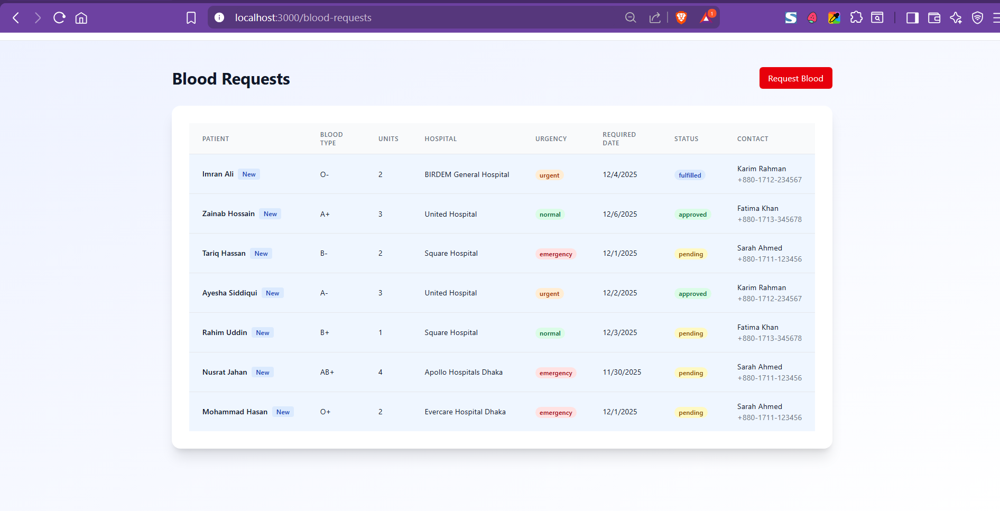

](image.png)# Quick Test Guide - Purchase Flow

## Prerequisites
- MongoDB is running and connected
- Server is running on http://localhost:5000
- Client is running on http://localhost:5173

## Test Scenario 1: Complete Purchase Flow ✅

### Step 1: User Makes Purchase
1. Open browser: `http://localhost:5173`
2. Click "Login" or navigate to `/login`
3. Login with test user or register new user
4. Navigate to "Buy Blood" or go to `/buy-blood`
5. Select blood type (e.g., "A+")
6. Click "Search"
7. Click "Purchase Now" on any available source
8. Fill out the form:
   - Units: 2
   - Urgency: Urgent
   - Patient Name: Test Patient
   - Patient Age: 30
   - Patient Condition: Surgery
   - Contact Name: Test Contact
   - Contact Phone: 01711111111
   - Contact Email: test@example.com
   - Delivery Address: Test Address, Dhaka
   - **Required Date**: Tomorrow's date
   - Additional Notes: Urgent case
9. Click "Submit Purchase Request"
10. ✅ **Expected**: Redirect to success page with tracking number

### Step 2: Verify in User Dashboard
1. Navigate to "My Purchases" or `/purchase-dashboard`
2. ✅ **Expected**: See the new purchase with status "PENDING"
3. Wait 30 seconds or click "Refresh" button
4. ✅ **Expected**: Purchase details are visible

### Step 3: Admin Views Purchase
1. Open new incognito/private window
2. Navigate to `http://localhost:5173/admin`
3. Login:
   - Username: `superadmin`
   - Password: `super@123`
4. Click "Manage Purchases" or navigate to `/admin/purchases`
5. ✅ **Expected**: See the new purchase in the list
6. ✅ **Expected**: User details are visible (name, email, phone)
7. Click "Refresh" to test manual refresh
8. ✅ **Expected**: Data refreshes

### Step 4: Admin Updates Status
1. Click "Update Status" on the purchase
2. Change status to "Verified"
3. Add admin notes: "Blood verified and ready for processing"
4. Set pickup details:
   - Pickup Date: Tomorrow
   - Pickup Time: 10:00 AM
   - Pickup Address: Main Building, Ground Floor
   - Special Instructions: Ask for reception desk
5. Click "Update"
6. ✅ **Expected**: Modal closes, purchase status updated

### Step 5: User Sees Update
1. Go back to user window
2. Wait 30 seconds or click "Refresh"
3. ✅ **Expected**: Status changed to "VERIFIED"
4. ✅ **Expected**: Admin notes are visible
5. ✅ **Expected**: Pickup details are shown

### Step 6: Complete the Flow
1. In admin window, update status to "Confirmed"
2. In user window, refresh and verify status change
3. In admin window, update status to "Ready"
4. In user window, refresh and verify:
   - ✅ Status is "READY"
   - ✅ "Download Receipt" button appears
5. Click "Download Receipt"
6. ✅ **Expected**: PDF receipt downloads

## Test Scenario 2: Purchase Cancellation ✅

1. Make a new purchase as user
2. In user dashboard, click "Cancel" on the pending purchase
3. Confirm cancellation
4. ✅ **Expected**: Status changes to "CANCELLED"
5. In admin dashboard, refresh
6. ✅ **Expected**: Purchase shows as cancelled

## Test Scenario 3: Filters and Search ✅

### Admin Side:
1. Make purchases with different:
   - Blood types (A+, B+, O+)
   - Source types (Organization, Hospital)
   - Statuses (Pending, Verified, Ready)
2. Test filters:
   - Filter by Status: "Pending"
   - ✅ **Expected**: Only pending purchases shown
   - Filter by Source Type: "Organization"
   - ✅ **Expected**: Only organization purchases shown
   - Filter by Blood Type: "A+"
   - ✅ **Expected**: Only A+ purchases shown

### User Side:
1. Click filter buttons (All, Pending, Verified, etc.)
2. ✅ **Expected**: Purchases filtered correctly

## Test Scenario 4: Auto-Refresh ✅

1. User has dashboard open
2. Admin updates a purchase status
3. Wait 30 seconds
4. ✅ **Expected**: User dashboard automatically shows updated status
5. Admin has dashboard open
6. User makes a new purchase
7. Wait 30 seconds
8. ✅ **Expected**: Admin dashboard automatically shows new purchase

## Test Scenario 5: Error Handling ✅

### Missing Required Fields:
1. Try to submit purchase without required date
2. ✅ **Expected**: Form validation prevents submission
3. Try to submit without patient name
4. ✅ **Expected**: Form validation prevents submission

### Invalid Data:
1. Try to set units to 0 or negative
2. ✅ **Expected**: Form prevents invalid input

### Unauthorized Access:
1. Try to cancel someone else's purchase
2. ✅ **Expected**: Error message shown

## Common Test Data

### Test User Credentials:
- Email: `test@example.com`
- Password: (your test password)

### Admin Credentials:
- Username: `superadmin`
- Password: `super@123`

### Test Blood Types:
- A+, A-, B+, B-, AB+, AB-, O+, O-

### Test Urgency Levels:
- Normal (green)
- Urgent (orange)
- Emergency (red)

## Expected Status Colors

- **Pending**: Yellow background
- **Verified**: Blue background
- **Confirmed**: Purple background
- **Ready**: Green background
- **Completed**: Dark green/white text
- **Cancelled**: Red background

## Troubleshooting

### Purchase not showing in admin dashboard:
- Check MongoDB connection
- Check if server route `/api/admin/purchases` is working
- Check admin authentication token
- Wait for auto-refresh or click "Refresh"

### User can't see status updates:
- Check user authentication token
- Check if `/api/blood-purchases/my-purchases` route works
- Wait for auto-refresh or click "Refresh"

### Form submission errors:
- Open browser console (F12)
- Check for validation errors
- Verify all required fields are filled
- Check network tab for API response

### Refresh not working:
- Check browser console for errors
- Verify API endpoints are responding
- Check authentication tokens

## Success Criteria

All of these should work:
- ✅ User can search and purchase blood
- ✅ Purchase appears in admin dashboard (within 30s)
- ✅ Admin can update status and add notes
- ✅ User sees updates (within 30s)
- ✅ Tracking number is generated
- ✅ Receipt can be downloaded
- ✅ Cancellation works correctly
- ✅ Filters work on both dashboards
- ✅ Auto-refresh works on both dashboards
- ✅ Manual refresh buttons work

---

**All tests passed!** ✅

The purchase flow is now smooth and error-free!
